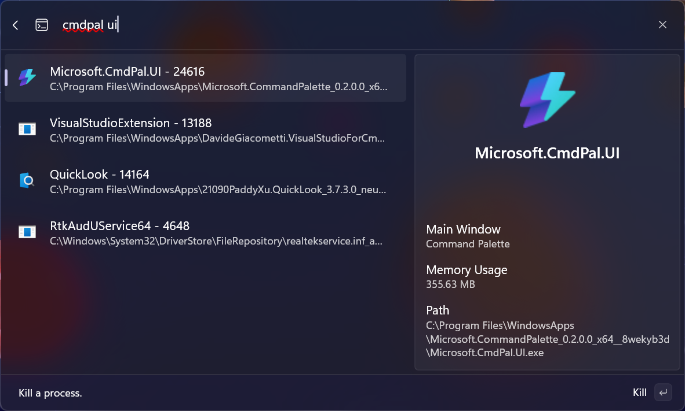
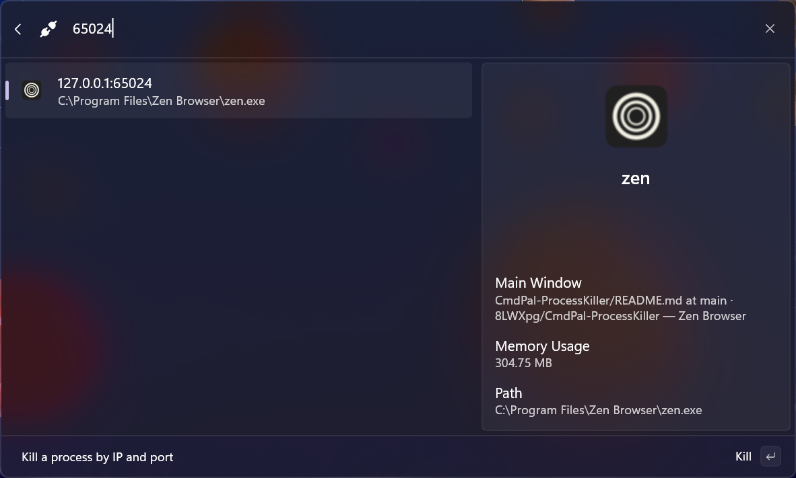

# Process Killer for CmdPal

> [!IMPORTANT]
> This project is still in early development

## Usage

### Kill a Process



### Kill a Process by Port



## Installation

Download `.msix` in release page, and run the following command in PowerShell:

```pwsh
Add-AppxPackage <msix> -AllowUnsigned
```
