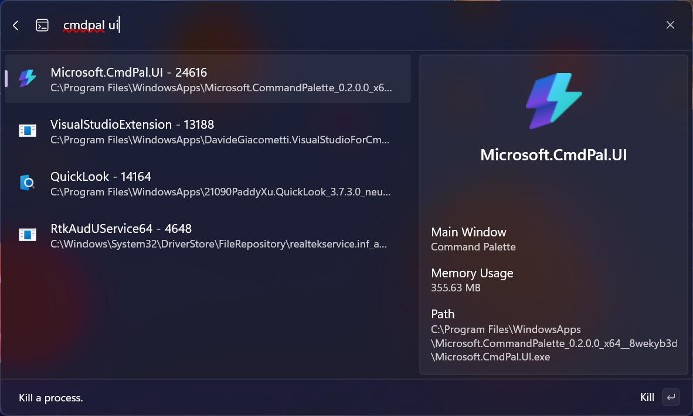
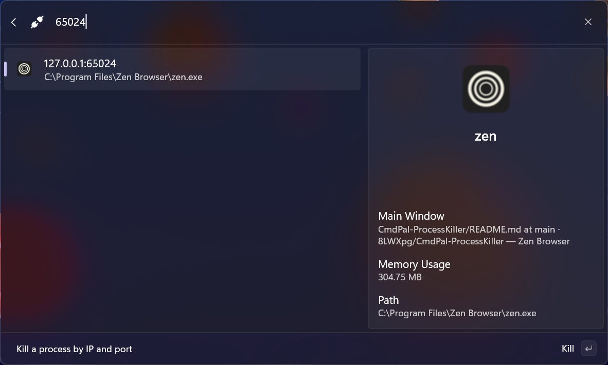

# Process Killer for CmdPal

> [!IMPORTANT]
> This project is still in early development

## Usage

### Kill a Process

### Kill a Process by Port

## Installation

I cannot get it published on MSStore and it's such a hassle to do that, so here's the workaround:

**Prerequisite**

- [winapp cli](https://github.com/microsoft/winappCli): `winget install Microsoft.WinAppCli`

**Steps**

1. Download both `msixbundle` and `cert.pfx`
2. `sudo winapp cert install cert.pfx` (or open terminal with admin privilege if you don't have sudo)
3. Click to install or `Add-AppxPackage <msix>`

